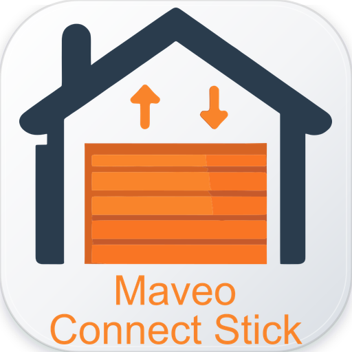
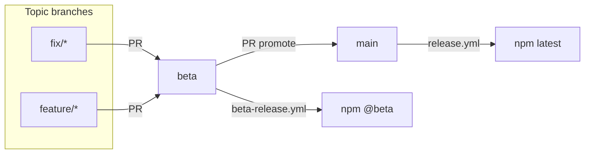
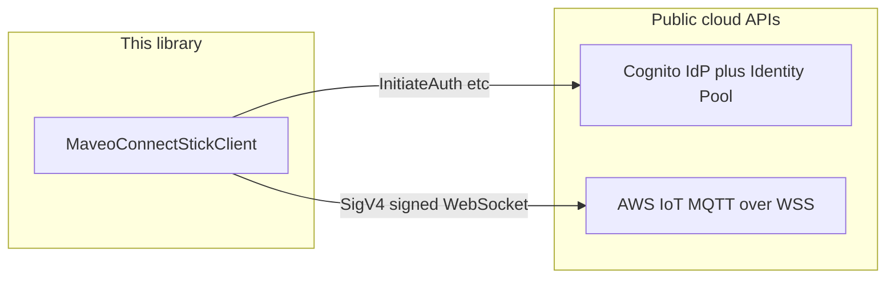
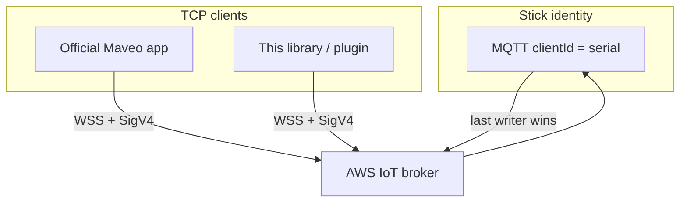
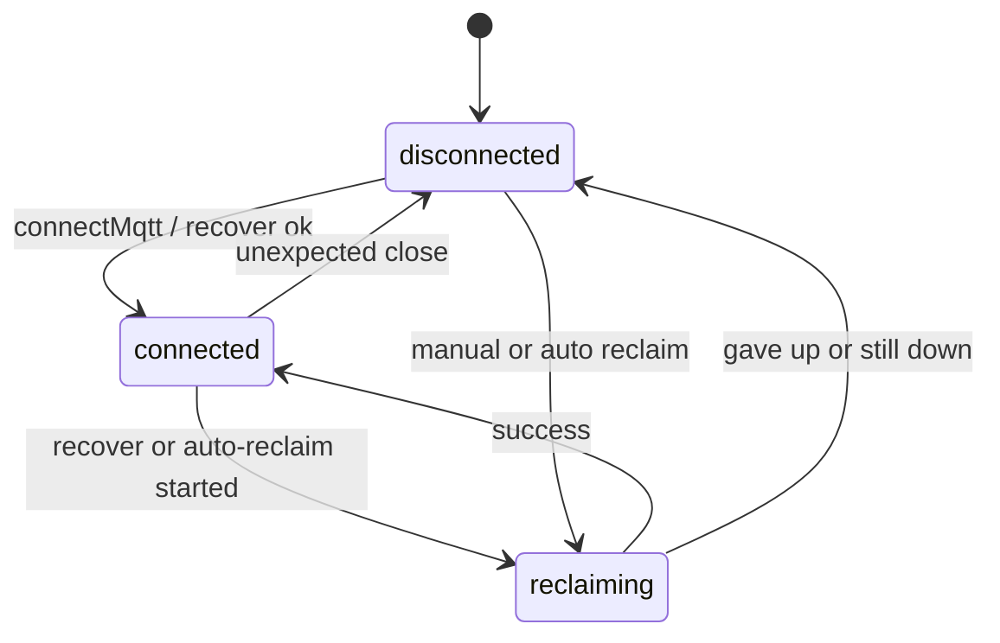
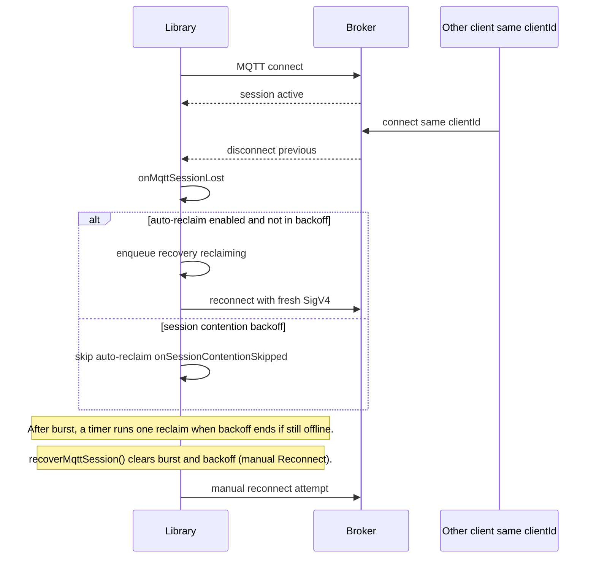

<p align="center">
  
</p>

# maveo-connect-stick-client

[](https://github.com/spid3r/maveo-connect-stick-client/actions/workflows/ci.yml)
[](https://github.com/spid3r/maveo-connect-stick-client/actions/workflows/release.yml)
[](https://github.com/spid3r/maveo-connect-stick-client/actions/workflows/beta-release.yml)
[](https://www.npmjs.com/package/maveo-connect-stick-client)
[](LICENSE)
[](package.json)
[](https://github.com/semantic-release/semantic-release)
[](https://conventionalcommits.org)

Standalone, **test-driven** TypeScript library for integrating with **Maveo / Marantec Connect** using the **normal email + password** path, then **MQTT over WebSocket** to Marantec’s IoT endpoints (as used by the official app).

> **Guest deep-link** (`?data=`) decoding is **not** implemented here yet; this repo targets the **logged-in IoT** stack first.

## Disclaimer

This is **third-party open source** software (see the [MIT License](LICENSE)). It is **not** a Marantec or Maveo product.

- **Unofficial project.** This library is **not** made by, endorsed by, or affiliated with **Marantec GmbH** (or its brands). **Marantec®**, **Maveo®**, and related marks belong to their owners.
- **Public interfaces only.** Behaviour here is implemented using **publicly reachable** cloud endpoints and protocols in the same way a normal logged-in client would use them (e.g. AWS Cognito, AWS IoT, MQTT over WebSocket). There is **no** use of private documentation, leaked keys, or non-public APIs as a distribution mechanism for this package.
- **No support from Marantec or Maveo.** Do **not** contact Marantec or Maveo support expecting help with this repository. They have **no obligation** to assist with third-party or community software, and using this code **does not** change your relationship with them or any warranty on their products.
- **Your compliance.** You are responsible for complying with **Marantec’s, Maveo’s, Amazon’s, and any other applicable** terms of service and acceptable-use policies when you use this library. If you are unsure whether your use is allowed, obtain professional advice; **do not** rely on this README as legal guidance.
- **Use at your own risk.** Garage doors and cloud accounts can cause **property damage, injury, or data loss** if misused. You are **solely responsible** for how you deploy this software and for keeping credentials safe. The authors **disclaim liability** to the extent permitted by law — see the [MIT License](LICENSE).
- **No guarantees.** Features may break if the vendor changes APIs, MQTT behaviour, or policies. There is **no** commercial support SLA unless you arrange one separately with a maintainer.

## Install

```bash
npm install maveo-connect-stick-client
```

Requires **Node.js ≥ 18.12** (see `engines` in [`package.json`](package.json)). Published builds ship compiled **`dist/`** only; develop from this repo with `npm ci` and `npm run build` if you link locally.

## Contributing and releases

- **Conventional Commits** are required (enforced in CI with [commitlint](https://commitlint.js.org/) and PR title lint for squash workflows). Example: `feat(mqtt): add reconnect helper`.
- **Branch flow** (same model as [loxberry-api-abfall-io](https://github.com/spid3r/loxberry-api-abfall-io)):
  - **`fix/*` / `feature/*` → `beta`** (PR): integration and pre-release testing.
  - **Push to `beta`** → [`.github/workflows/beta-release.yml`](.github/workflows/beta-release.yml): semantic-release publishes a **preview** pre-release **`{nextStable}-beta.N`** to npm with dist-tag **`beta`** (e.g. `1.2.0-beta.1` while stable on npm is `1.1.0` — the beta number tells you what the next stable semver will be).
  - **`beta` → `main`** (PR): when ready, merge to ship stable; push to **`main`** → [`.github/workflows/release.yml`](.github/workflows/release.yml): stable release to npm **`latest`** + GitHub Release.
- **Pre-release SemVer:** A preview like `1.2.0-beta.1` is **newer** than installed stable `1.1.0` (`npm install maveo-connect-stick-client@beta`). Same-line betas (e.g. `1.1.0-beta.2` when stable is already `1.1.0`) are **older** than stable — use `@beta` only while testing the upcoming line.
- **Configuration:** [`.releaserc.json`](.releaserc.json) defines **`main`** (stable) and **`beta`** (`prerelease: true`). No custom release scripts — semantic-release owns versioning on both branches.
- **Dry run locally:** `npm run release:dry-run` (current branch) or `npm run release:beta:dry-run` (simulate beta pre-release only). Installs semantic-release tooling temporarily; does not publish.
- **Publishing to npm** uses [Trusted Publishing](https://docs.npmjs.com/trusted-publishers) (OIDC). Register **both** workflow filenames on npmjs: `release.yml` (stable) and `beta-release.yml` (pre-releases). Optional `NPM_TOKEN` repository secret is only a migration fallback — **never** commit tokens or Maveo account secrets.



## Secrets and local configuration

Nothing vendor-specific or account-specific lives in the repository. All sensitive or per-user values are kept on disk and gitignored:

| File | Purpose |
|------|---------|
| `.env` | Your own credentials and the four required `MAVEO_COGNITO_*`, `MAVEO_REGION`, `MAVEO_IOT_HOSTNAME` values discovered from your own copy of the official app's `awsconfiguration.json`. See [`.env.example`](.env.example) for the full key list and [docs/AUTH_FLOW.md](docs/AUTH_FLOW.md) for the discovery steps. |
| `cognito-stacks.local.json` | Optional. Array of `{ name, region, clientId }` entries used by `npm run cli -- cognito` to probe which stack accepts your password. Matched by the gitignored `*.local.json` rule. |

CI runs **unit tests only** by default — it never logs in to the real Maveo cloud and needs **no GitHub secrets**. A ready-to-enable opt-in workflow lives at [`.github/workflows/live-test.yml.disabled`](.github/workflows/live-test.yml.disabled); rename it to drop `.disabled`, add the matching repository secrets, and read the warning header carefully — every live CI run kicks the official app off MQTT for the configured stick.

## Table of contents

- [Disclaimer](#disclaimer)
- [Install](#install)
- [Contributing and releases](#contributing-and-releases)
- [Secrets and local configuration](#secrets-and-local-configuration)
- [Requirements](#requirements)
  - [Runtime npm dependencies (audit)](#runtime-npm-dependencies-audit)
- [Quick start](#quick-start)
- [MQTT session lifecycle](#mqtt-session-lifecycle)
  - [Is it all parametrizable?](#is-it-all-parametrizable)
  - [Reclaim & session contention (parameter reference)](#reclaim--session-contention-parameter-reference)
  - [Abstract: one `clientId`, one live session](#abstract-one-clientid-one-live-session)
  - [Facade transport state](#facade-transport-state)
  - [Detailed: remote kick, auto-reclaim, burst backoff](#detailed-remote-kick-auto-reclaim-burst-backoff)
- [Configuration](#configuration)
  - [Plugin / UI: `onMaveoLifecycle`](#plugin--ui-onmaveolifecycle)
  - [LoxBerry plugin: long-running Node service](#loxberry-plugin-long-running-node-service)
- [Project layout](#project-layout)
- [LoxBerry 3](#loxberry-3)
- [Docs](#docs)
- [License](#license)

## Requirements

- **Node.js ≥ 18.12** (matches LoxBerry 3–class deployments; see [docs/LOXBERRY.md](docs/LOXBERRY.md)).

### Runtime npm dependencies (audit)

Everything under **`dependencies`** in `package.json` is referenced from `src/`:

| Package | Role |
|---------|------|
| `@aws-sdk/client-cognito-identity-provider` | `InitiateAuth` (email/password) |
| `@aws-sdk/client-cognito-identity` | `GetId` / `GetCredentialsForIdentity` |
| `@aws-sdk/client-iot` | `ListPrincipalThings` / `DescribeThing` (own-stick discovery + metadata) |
| `@smithy/signature-v4`, `@smithy/protocol-http`, `@aws-crypto/sha256-js` | SigV4 signing for the MQTT WSS upgrade |
| `mqtt` | MQTT v5 over WebSocket |
| `zod` | Env schema in `src/config/env.ts` and auth config |

**Dev:** `typescript`, `vitest`, `@types/node`, `dotenv` (tests / CLI ergonomics only).

## Quick start

High-level path (same public stack the official logged-in app uses):



```bash
cd C:\Github\maveo-connect-stick-client
npm ci
npm run prepare   # one-time: sets up Husky git hooks (skipped by .npmrc ignore-scripts)
npm test
npm run build
```

**Why the explicit `npm run prepare`?** This repo ships an [`.npmrc`](.npmrc) with **`ignore-scripts=true`** to defend against supply-chain attacks via dependency install scripts (e.g. malicious `postinstall`). That same flag also blocks our own root `prepare` script (which installs Husky's git hooks), so contributors run it once after a fresh `npm ci`. CI does not need git hooks (`HUSKY=0` in workflows) and is unaffected.

**No vendor defaults.** This library deliberately does **not** ship Cognito client / pool ids, regions, or IoT hostnames. Set **all four** of `MAVEO_COGNITO_CLIENT_ID`, `MAVEO_COGNITO_IDENTITY_POOL_ID`, `MAVEO_REGION`, and `MAVEO_IOT_HOSTNAME` from your **own** copy of the official mobile app's `awsconfiguration.json` (see [docs/AUTH_FLOW.md](docs/AUTH_FLOW.md)). If login fails with `UserNotFoundException`, you have the wrong stack — re-verify those four values. If you maintain notes on multiple stacks, drop them in a local `cognito-stacks.local.json` (gitignored) and run **`npm run cli -- cognito`** to probe which one accepts your password.

**Discover the user's own Connect Sticks (no MQTT required):** after login, **`listMaveoConnectSticks(session)`** returns the array of stick serials attached to the calling Cognito identity (uses **`iot:ListPrincipalThings`**). This is the right call for plugin/UI flows like *"let the user pick which stick to control"* (e.g. LoxBerry's device picker). For per-stick metadata, follow up with **`describeMaveoThing(session, serial)`**. End-to-end demo: **`npm run cli -- garage`** (builds first; logs in, prints your sticks, describes the first one). The legacy **`listMaveoThings(session)`** uses account-wide `iot:ListThings` and is kept exported for advanced/diagnostic use; prefer the identity-scoped helper for end-user flows.

**MQTT over WSS** uses **header-based SigV4** with service **`iotdata`** and **`wss://…:443/mqtt`** (official app wire format — not `iotdevicegateway` query presign). The MQTT client uses **protocol version 5** by default. **MQTT `clientId`:** Marantec’s broker expects the **Connect Stick serial** (same value as **`MAVEO_THING_NAME`** / app display). Set **`MAVEO_THING_NAME`** or **`MAVEO_MQTT_CLIENT_ID`** to that serial; using the Cognito **identity id** alone typically yields CONNACK **“Not authorized”**. **Smoke-test MQTT** (full CONNECT + CONNACK): `MAVEO_LIVE_TEST=1`, `MAVEO_RUN_LIVE_MQTT=1`, stick serial in env, then `npx vitest run tests/live.iot.test.ts -t "connects and disconnects"`. **Listen** on `…/rsp` and print JSON: **`npm run cli -- listen`** (optional `MAVEO_LISTEN_MS`, `MAVEO_RUN_OPEN=1` is dangerous). **Guided live scenario** (open → dwell → stop → light → close): set `MAVEO_LIVE_TEST=1`, `MAVEO_RUN_LIVE_MQTT=1`, stick serial, and **`MAVEO_RUN_BLUEFI_SCENARIO=1`** (see `.env.example`). Run **`npm test`** or **`npm run bluefi:scenario`**. **Passive listen** (no SDK door commands; you use the handheld): add **`MAVEO_LIVE_BLUEFI_PASSIVE=1`** and run **`npm run bluefi:passive`**. **`MAVEO_LIVE_BLUEFI_START_DELAY_MS`** (e.g. `20000`) adds a one-time pause at the start of each BlueFi live test so you can reach the garage before anything moves. Live `mqtt.connect` test uses the same base flags.

**Tests:** `npm test` runs **all** Vitest files. If your `.env` enables live flags, those suites hit the real cloud/stick (slow / moves hardware). For a **fast offline** run: `npm run test:unit` (excludes `tests/live.*.test.ts`). **Live** suites use flags in `.env.example`. **`MAVEO_LIVE_BLUEFI_DOOR=1` moves the real door** (open then close); use only when safe. **`MAVEO_LIVE_BLUEFI_PASSIVE=1`** only **listens** — operate the door with your handheld; the test logs `StoA_s` / `StoA_l_r` updates.

**Long-running MQTT:** WSS uses **SigV4 in the upgrade headers**; they are tied to **temporary Cognito credentials** (~1h). `mqtt.js` auto-reconnect with a fixed URL would reuse **stale** headers and fail (see `maveo-stick-node`: `reconnectPeriod: 0`, refresh creds, then connect again). This library keeps `reconnectPeriod: 0`. Use `isMaveoSessionCredentialsNearExpiry(session)`, then `await client.recoverMqttSession()` (or `login` + `reconnectMqtt` + `subscribeBlueFiResponses`), and **re-register** `onStickState` / `onMqttMessage` — listeners belong to the old socket. **Manual reconnect (same idea as the app button):** call **`await client.recoverMqttSession()`** after a drop (or proactively), then **re-attach** your `onStickState` / `onMqttMessage` handlers — a LoxBerry plugin can expose that as a “Reconnect MQTT” action the same way.

**One MQTT session per stick serial:** the broker uses a fixed **`clientId`** (the Connect Stick serial). The **Maveo app** and **this library** cannot both stay connected reliably — the last one to connect typically **disconnects the other**. For integration tests, **close or force-stop the app**. Detect drops with `client.isMqttConnected()`, `client.onMqttConnectionLost()` (unexpected loss only — not your own `disconnectMqtt`), or `client.onMqttSessionLost()` for full detail (`suspectedRemoteSessionTakeover` when the app steals the session). **Fight back:** `await client.reclaimMqttSessionWithRetries({ maxAttempts: 8, delayMsBetweenAttempts: 2000 })` or `client.enableAutomaticMqttReclaim({ ... })` — then **re-bind** `onStickState` in `onRecovered`. **`client.getMqttTransportState()`** is `connected` | `disconnected` | `reclaiming`. **Coexist with the app:** `enableAutomaticMqttReclaim({ sessionContention: true })` uses defaults **3 remote kicks within 10s → pause auto-reclaim for 2 minutes** (override with **`MAVEO_MQTT_CONTENTION_BACKOFF_MS`**); when that backoff ends, **one timer-based reclaim** runs if you are **still disconnected** — you do not need another disconnect event. Your **manual** `recoverMqttSession()` (Reconnect button) still clears backoff via `clearSessionContentionState()`. Inspect **`client.getAutoReclaimBackoffUntilMs()`** for UI countdown.

## MQTT session lifecycle

### Is it all parametrizable?

**Yes.** Behaviour is driven by **constructor options**, **method options**, and (for plugins that read `.env`) **optional env vars** plus **`mergeAutomaticMqttReclaimOptionsFromEnv`**.

| Concern | API | Optional env | Typical default |
|--------|-----|--------------|-----------------|
| BlueFi read timeout (`getDoorPosition` / `getLightOn`) | `MaveoConnectStickClientOptions.blueFiReadTimeoutMs` | — | `10000` ms |
| Poll interval while waiting (fail fast if MQTT drops) | `blueFiRspPollIntervalMs` | `MAVEO_BLUEFI_RSP_POLL_MS` (via `createMaveoConnectStickClientFromEnv` only) | `400` ms |
| Reclaim retry count / spacing | `reclaimMqttSessionWithRetries({ … })`, `enableAutomaticMqttReclaim({ … })` | `MAVEO_MQTT_RECLAIM_MAX_ATTEMPTS`, `MAVEO_MQTT_RECLAIM_DELAY_MS` (merge helper below) | `5` / `1500` ms |
| Session contention (burst → pause auto-reclaim) | `sessionContention: true \| MqttSessionContentionPolicy` | `MAVEO_MQTT_SESSION_CONTENTION`, `MAVEO_MQTT_CONTENTION_*` (merge helper) | 3 losses / 10 s → backoff 120 s |
| Manual reconnect still wins | `recoverMqttSession()` default clears burst + backoff; explicit UI “Reconnect” | — | — |
| Background reconnect without resetting contention | `recoverMqttSession({ resetSessionContention: false })` — keeps kick history for burst detection | — | — |

**Burst counting:** each **remote** session loss counts toward the threshold **even while an auto-reclaim retry is already running** (so three quick app reconnects are not “eaten” by `autoReclaimInFlight`). Successful **auto-reclaim** / **`recoverMqttSession({ resetSessionContention: false })`** does **not** reset the kick timestamps — only the rolling window prunes them — so three takeovers in 10s still register even if the library briefly reconnects between kicks. After a burst, backoff is preserved the same way (manual `recoverMqttSession()` default still clears everything).

**Env wiring:** `createMaveoConnectStickClientFromEnv()` applies **`MAVEO_BLUEFI_RSP_POLL_MS`** when you omit `blueFiRspPollIntervalMs`. For auto-reclaim, pass **`mergeAutomaticMqttReclaimOptionsFromEnv(process.env, { onRecovered: … })`** into `enableAutomaticMqttReclaim` so reclaim limits and contention policy can live in `.env` without duplicating numbers. Explicit **`maxAttempts`**, **`delayMsBetweenAttempts`**, callbacks, and a **`sessionContention` object** override env; **`sessionContention: true`** is merged with env so **`MAVEO_MQTT_CONTENTION_*`** (e.g. backoff ms) still apply. Lower-level **`MaveoMqttIotClientOptions`** (protocol, host, QoS, etc.) stay on `options.mqtt` if you need them.

### Reclaim & session contention (parameter reference)

**Two ways to reconnect after a drop**

| Mechanism | What it does |
|-----------|----------------|
| **`reclaimMqttSessionWithRetries({ … })`** | One **batch** of attempts (each attempt runs `recoverMqttSessionCore`). Returns `{ ok, lastError? }`. Does **not** subscribe to future losses. |
| **`enableAutomaticMqttReclaim({ … })`** | Subscribes to **`onMqttSessionLost`**. On each **unexpected** loss, runs the same retry batch (unless contention backoff says skip). Returns an **unsubscribe** function. |

**Retry batch** (both use `ReclaimMqttSessionOptions` plus contention fields below):

| Option / env | Meaning | Default |
|--------------|---------|---------|
| `maxAttempts` / `MAVEO_MQTT_RECLAIM_MAX_ATTEMPTS` | How many **`recoverMqttSessionCore`** tries per batch (one CONNECT + subscribe `…/rsp` per try). | `5` |
| `delayMsBetweenAttempts` / `MAVEO_MQTT_RECLAIM_DELAY_MS` | Pause **between** failed attempts in the same batch (ms). | `1500` |
| `refreshCredentials` | If `true`, forces **`login()`** before each attempt; default is refresh only when Cognito creds are near expiry. | near-expiry only |
| `stickId` | Override stick serial for subscribe (rare). | env / `stickSerial()` |

**Session contention** (`sessionContention: true` or `MqttSessionContentionPolicy`, or env via `mergeAutomaticMqttReclaimOptionsFromEnv`):

| Field / env | Meaning | Default |
|-------------|---------|---------|
| `burstWindowMs` / `MAVEO_MQTT_CONTENTION_BURST_WINDOW_MS` | Rolling window (ms) for counting **remote** session losses. | `10000` |
| `burstThreshold` / `MAVEO_MQTT_CONTENTION_BURST_THRESHOLD` | How many losses inside that window trigger a burst. | `3` |
| `backoffAfterBurstMs` / `MAVEO_MQTT_CONTENTION_BACKOFF_MS` | After a burst, **auto-reclaim** stays off for this long (ms) so the official app can hold MQTT. When this period ends, the client runs **one** reclaim attempt if still disconnected (a timer — not only a new `onMqttSessionLost`, since you may already be offline). **`getAutoReclaimBackoffUntilMs()`** is the wall-clock end. Env accepts **5000–86400000** ms. | `120000` |
| `MAVEO_MQTT_SESSION_CONTENTION` | `1` / `true` enables defaults; `0` / `false` disables contention from env. | — |

**Callbacks on `enableAutomaticMqttReclaim`** (optional): `onRecovered`, `onReclaimExhausted`, `onSessionContentionBurst`, `onSessionContentionSkipped`, `onStateChange`. The same moments also appear on **`onMaveoLifecycle`** when listeners are registered.

**`recoverMqttSession()`**

| Option | Meaning |
|--------|---------|
| Default | Clears contention **backoff + kick history**, then reconnects (use for a clear **“Reconnect MQTT”** action). |
| `resetSessionContention: false` | Keeps kick history and backoff rules; use for **background** loops that must not erase burst detection (and do not combine with a competing auto-reclaim timer). |

**Shorter backoff for live tests** (e.g. `bluefi:passive`): you do not need to wait two minutes. In `.env` set for example **`MAVEO_MQTT_CONTENTION_BACKOFF_MS=10000`** (10 s pause after a burst). Production plugins can omit it and keep the default **120000** ms.

### Abstract: one `clientId`, one live session

The broker effectively hands **one MQTT session** to whoever last authenticated with the stick’s **`clientId`**. Your integration and the official app **time-share** that slot; they do not get two independent subscriptions.



### Facade transport state

What **`getMqttTransportState()`** reports is a **coarse UI / logic** state: idle disconnected, healthy connected, or reclaim work in flight.



### Detailed: remote kick, auto-reclaim, burst backoff

When another client connects with the same **`clientId`**, your socket drops. The library can **retry reconnect** in a queue; **session contention** counts those **remote** losses in a rolling window and **pauses auto-reclaim** after a burst so the app can hold the line. **Manual** `recoverMqttSession()` is intended to **clear** that backoff and try anyway (e.g. “Reconnect” in a plugin).



## Configuration

Copy `.env.example` → `.env` (never commit `.env`). All of the following are **required** — discover them in your own copy of the official app's `awsconfiguration.json` (see [docs/AUTH_FLOW.md](docs/AUTH_FLOW.md)):

- `MAVEO_EMAIL`, `MAVEO_PASSWORD` (your own account)
- `MAVEO_COGNITO_CLIENT_ID` (Cognito User Pool app client id)
- `MAVEO_COGNITO_IDENTITY_POOL_ID` (Cognito Identity Pool id, `<region>:<uuid>`)
- `MAVEO_REGION` (AWS region matching the two ids above)
- `MAVEO_IOT_HOSTNAME` (fully-qualified IoT broker hostname; no scheme, no path)

**High-level facade** (recommended when you already have `MAVEO_THING_NAME` / `MAVEO_MQTT_CLIENT_ID` in env):

```ts
import {
  createMaveoConnectStickClientFromEnv,
  maveoDoorPositionLabel,
} from "maveo-connect-stick-client";

const client = createMaveoConnectStickClientFromEnv();
await client.login();
await client.connectMqtt();
await client.subscribeBlueFiResponses();

const unsub = client.onStickState((u) => {
  if (u.doorPosition !== undefined) console.log("door:", maveoDoorPositionLabel(u.doorPosition));
  if (u.lightOn !== undefined) console.log("light on:", u.lightOn);
});

console.log(await client.getDoorPosition(), await client.getLightOn());
await client.publishGarageDoor("open");
await client.publishGarageDoor("close");

unsub();
await client.disconnectMqtt();
```

### Plugin / UI: `onMaveoLifecycle`

Use **`client.onMaveoLifecycle((e) => { … })`** for a single discriminated stream (`MaveoConnectStickLifecycleEvent`):

| `e.kind` | When |
|----------|------|
| `stick_state` | Door / light push (`StoA_s`, `StoA_l_r`) — same data as `onStickState` |
| `mqtt_connection_lost` | Unexpected loss (`close` / `offline`, deduped) |
| `mqtt_session_lost` | Full detail; `e.event.intentionalDisconnect` is local `disconnectMqtt` |
| `transport_state` | `connected` / `disconnected` / `reclaiming` |
| `manual_recover_started` / `manual_recover_finished` | Around `recoverMqttSession()` |
| `session_contention_burst` / `session_contention_skipped` | After **`enableAutomaticMqttReclaim({ sessionContention: … })`** — app “won” the `clientId` burst or backoff active |
| `automatic_reclaim_recovered` / `automatic_reclaim_exhausted` | Auto-reclaim retry batch finished |

Call **`enableAutomaticMqttReclaim(mergeAutomaticMqttReclaimOptionsFromEnv(process.env, { … }))`** so contention + reclaim events actually fire. The per-option callbacks (`onRecovered`, `onSessionContentionBurst`, …) still run; lifecycle is an extra channel for one plugin entry point. Removing the last `onMaveoLifecycle` subscriber tears down internal bridges.

**Coexistence with the app:** a timer or “watchdog” that calls `recoverMqttSession()` on disconnect must use **`resetSessionContention: false`**. The default call clears the kick counter on every attempt, so `sessionContention` never sees three app takeovers and the library keeps winning MQTT forever.

### LoxBerry plugin: long-running Node service

Use one **`MaveoConnectStickClient`**, env-based config (**`createMaveoConnectStickClientFromEnv`**), **`mergeAutomaticMqttReclaimOptionsFromEnv`** for `.env`-tunable reclaim/contention, and **re-bind** listeners after every reconnect (`onStickState` / `onMqttMessage` are per-socket). See [docs/LOXBERRY.md](docs/LOXBERRY.md) for install and repo split.

```ts
import {
  createMaveoConnectStickClientFromEnv,
  mergeAutomaticMqttReclaimOptionsFromEnv,
} from "maveo-connect-stick-client";

async function runPluginBackend() {
  const client = createMaveoConnectStickClientFromEnv();

  const offLifecycle = client.onMaveoLifecycle((e) => {
    if (e.kind === "transport_state") {
      /* drive status LED / web UI */
    }
    if (e.kind === "session_contention_burst") {
      /* optional: log that the official app likely holds MQTT until backoff */
    }
  });

  let unstick: () => void = () => {};
  const bindStickState = () => {
    unstick();
    unstick = client.onStickState((u) => {
      /* map door / light to GPIO, UDP, Loxone, etc. */
    });
  };

  await client.login();
  await client.connectMqtt();
  await client.subscribeBlueFiResponses();
  bindStickState();

  const stopAutoReclaim = client.enableAutomaticMqttReclaim(
    mergeAutomaticMqttReclaimOptionsFromEnv(process.env, {
      sessionContention: true,
      onRecovered: () => bindStickState(),
    }),
  );

  const shutdown = async () => {
    stopAutoReclaim();
    offLifecycle();
    unstick();
    await client.disconnectMqtt();
  };

  process.once("SIGINT", () => void shutdown().then(() => process.exit(0)));
  process.once("SIGTERM", () => void shutdown().then(() => process.exit(0)));
}

runPluginBackend().catch((e) => {
  console.error(e);
  process.exit(1);
});
```

**Lower-level** (explicit config + stick id):

```ts
import {
  loadMaveoLibraryConfigFromEnv,
  MaveoCognitoAuthClient,
  MaveoMqttIotClient,
  maveoStickRspTopic,
} from "maveo-connect-stick-client";

const cfg = loadMaveoLibraryConfigFromEnv();
const auth = new MaveoCognitoAuthClient({ authConfig: cfg });
const session = await auth.loginWithPassword(cfg.email, cfg.password);
const iot = new MaveoMqttIotClient();
await iot.connect(session);
const stickId = "YOUR_STICK_SERIAL";
await iot.subscribeBlueFiResponses(stickId);
await iot.publishGarageDoorCommand(stickId, "open");
// responses on maveoStickRspTopic(stickId); see docs/AGENT_HANDOFF.md §4b
```

## Project layout

| Path | Purpose |
|------|---------|
| `src/config/` | Env validation (Zod), stick serial resolution. |
| `src/auth/` | Cognito login → `MaveoSession`. |
| `src/iot/` | SigV4 WSS + MQTT v5 + BlueFi topics. |
| `src/client/` | `MaveoConnectStickClient` facade. |
| `tests/` | Vitest specs. |
| `scripts/` | Optional dev CLI (`npm run cli -- …`); not published in the npm package. |
| `docs/` | Architecture, auth checklist, LoxBerry notes. |

## LoxBerry 3

Node.js **is** usable on LoxBerry 3. Keep this package **library-only**; add a **separate** LoxBerry plugin repo later that depends on this project. Details: [docs/LOXBERRY.md](docs/LOXBERRY.md). A **minimal service skeleton** (lifecycle, auto-reclaim, re-bind `onStickState`) is in [Plugin / UI](#loxberry-plugin-long-running-node-service) above.

## Docs

- [Architecture](docs/ARCHITECTURE.md) — modules + wire protocol summary
- [Auth flow + Marantec stack table](docs/AUTH_FLOW.md)
- [LoxBerry + Node](docs/LOXBERRY.md)
- [Maintainer / agent index](docs/AGENT_HANDOFF.md) — links only, no secrets

## License

### MIT

This project is released under the **[MIT License](LICENSE)** ( SPDX: `MIT` — same as `package.json`).

### Beerware spirit (optional thanks)

If this library saved you time, you’re welcome to **buy the maintainer a beer** (or a coffee) — entirely optional, no strings attached.

- **Maintainers:** add your **Ko-fi**, **PayPal**, **GitHub Sponsors**, or similar URL here when you publish the repo.
- **Beerware (classic spirit):** *“If we meet some day, and you think this stuff is worth it, you can buy me a beer in return.”* — Poul-Henning Kamp’s idea, often paired with permissive licenses like MIT.

Nothing in this section creates a contract or obligation to pay; it is simply a friendly way to say thanks.

### Full terms

The legal text (including warranty disclaimer and liability cap) is in [`LICENSE`](LICENSE). The [Disclaimer](#disclaimer) at the top of this README summarizes affiliation and support expectations.
